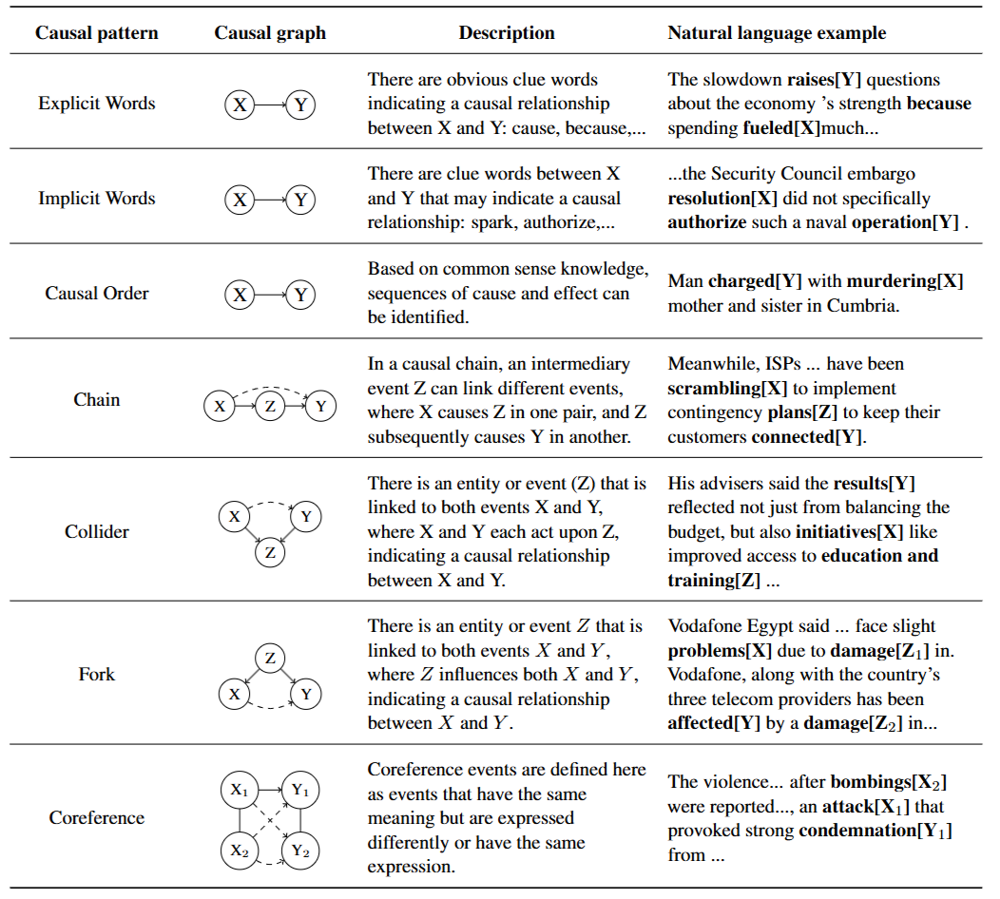
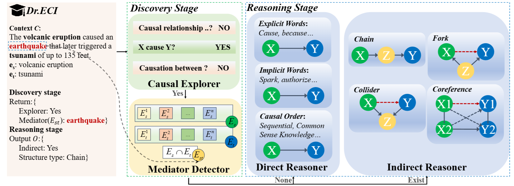
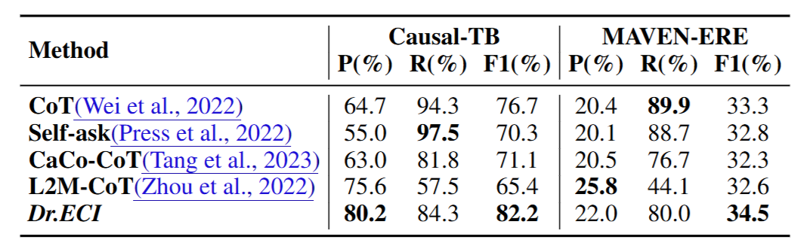
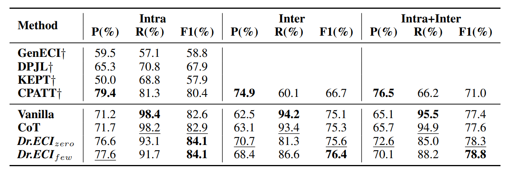
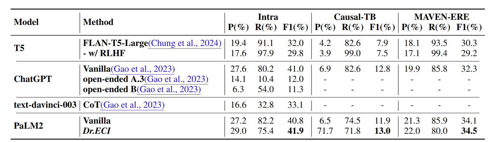
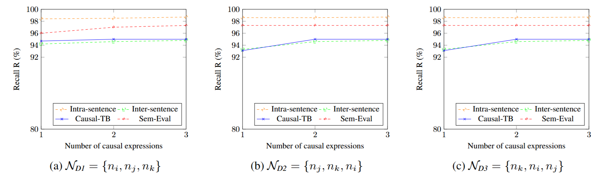

# Dr.ECI

Welcome to the official repository for "Dr.ECI: Infusing Large Language Models with Causal Knowledge for Decomposed Reasoning in Event Causality Identification". Dr.ECI is an innovative framework that enhances the causal reasoning capabilities of large language models (LLMs) for Event Causality Identification (ECI) tasks.

Dr.ECI has been accepted by COLING 2025!

## Abstract

Despite the demonstrated potential of Large Language Models (LLMs) in diverse NLP tasks, their causal reasoning capability appears inadequate when evaluated within the context of the event causality identification (ECI) task. The ECI tasks pose significant complexity for LLMs and necessitate comprehensive causal priors for accurate identification. To improve the performance of LLMs for causal reasoning, we propose a multi-agent Decomposed reasoning framework for Event Causality Identification, designated as *Dr.ECI*. In the discovery stage, *Dr.ECI* incorporates specialized agents such as *Causal Explorer* and *Mediator Detector*, which capture implicit causality and indirect causality more effectively. In the reasoning stage, *Dr.ECI* introduces the agents *Direct Reasoner* and *Indirect Reasoner*, which leverage the knowledge of the generalized causal structure specific to the ECI. Extensive evaluations demonstrate the state-of-the-art performance of *Dr.ECI* comparing with baselines based on LLMs and supervised training. 

## About Dr.ECI

### An overview of the causal patterns in ECI

We employ causal graph theory to systematically summarize explicit and implicit causal structures under the ECI task via Directed Acyclic Graphs (DAGs). Causal patterns within ECI are categorized into direct and indirect causal reasoning.




### Dr.ECI comprises 4 agents: *Causal Explorer*, *Mediator Detector*, *Direct Reasoner* and *Indirect Reasoner*

*Dr.ECI* is a multi-agent framework designed to enhance causal reasoning in large language models (LLMs) for Event Causality Identification (ECI). It comprises two stages: discovery and reasoning.




**Discovery Stage:** Given a context \(C\) and an event pair \((e_s, e_t)\), the *Causal Explorer* identifies potential causal relationships using expressions like \(\mathcal{N} = \{\text{causal relationship}, \text{causation}, \text{causality}\}\). If a causal link is found, the *Mediator Detector* identifies mediators \((E_{st})\) that could act as intermediaries between \(e_s\) and \(e_t\).

**Reasoning Stage:** If mediators \(E_{st} \neq \emptyset\), the *Indirect Reasoner* uses indirect causal patterns from causal priors to identify the relationship. If no mediators are present, the *Direct Reasoner* applies direct causal patterns. The final output reflects the identified causal relationship, utilizing structured causal patterns.

## About Experiments

Follow the testing setting proposed by Zhang et al.





---

Adhere to the work of Gao et al. when evaluating its performance on the development set.



## Analysis

The results presented in the figure below indicate that as the number of causal expressions identified by the *Causal Explorer* increases, the Recall (R) also tends to increase.



## How to Run Dr.ECI?

The following steps will run *Dr.ECI* to solve the ECI task. The runtime may vary depending on the inference speed of the API and the size of the dataset. To validate the effectiveness of the updated model in our method, we use the DeepSeek model as the underlying LLMs for this purpose.

**Note:** Before running the code in the steps below, please ensure that you add the DeepSeek API key to the code files.

### Step 1: *Causal Explorer*

1. Navigate to the `./agent1` directory.
2. Choose a dataset for causal exploration.
3. Run the following command to initiate the causal exploration:

   ```bash
   python explorer_ds.py
   ```

This step will process the dataset and return results when `N = {causal relationship, causation, causality}`.

### Step 2: *Mediator Detector*

1. Move to the `./agent2` directory.

2. Based on the results from Step 1, filter the results using a threshold of `q >= 1`. Run the following command to apply the threshold:

   ```bash
   python choose.py
   ```

4. The dataset filtered by the threshold will be used as input for the next step. Run:

   ```bash
   python mediator_ds.py
   ```

   This will identify mediators between the event pairs and provide the results.

### Step 3: *Direct Reasoner* and *Indirect Reasoner*

1. Navigate to the `./agent3` directory.

2. Extract the mediators from Step 2, and format the data for inference. Run:

   ```bash
   python get_mediator.py
   ```

4. Once the mediators are formatted, run the reasoners to infer the causal relationships:

   ```bash
   python reasoner_ds.py
   ```

   The output will consist of causal relationships identified by different causal structures (e.g., direct, indirect).

## Example Usage

### Input:

```json
{
    "text": "Whether Polly Peck's acquisition makes sense remains to be seen, but at the news conference, Mr. Nadir brimmed with self-confidence that he can turn Sansui around.",
    "source event": "turn",
    "target event": "brimmed",
    "question": "Is there a causal relationship between turn and brimmed?"
}
```

### Output:

```json
{
    "Answer": "No"
}
```

## Citations

If you find the paper and code useful, please kindly star this repository and cite the following paper:

```
@inproceedings{cai2025dr,
  title={Dr. ECI: Infusing Large Language Models with Causal Knowledge for Decomposed Reasoning in Event Causality Identification},
  author={Cai, Ruichu and Yu, Shengyin and Zhang, Jiahao and Chen, Wei and Xu, Boyan and Zhang, Keli},
  booktitle={Proceedings of the 31st International Conference on Computational Linguistics},
  pages={9346--9375},
  year={2025}
}
```